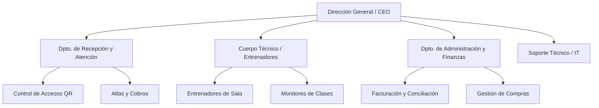
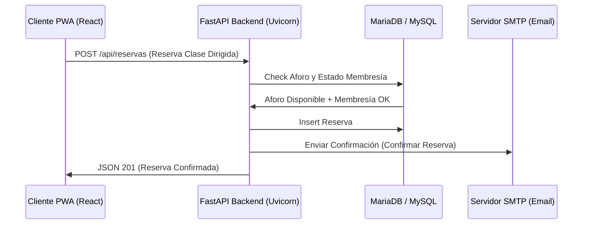
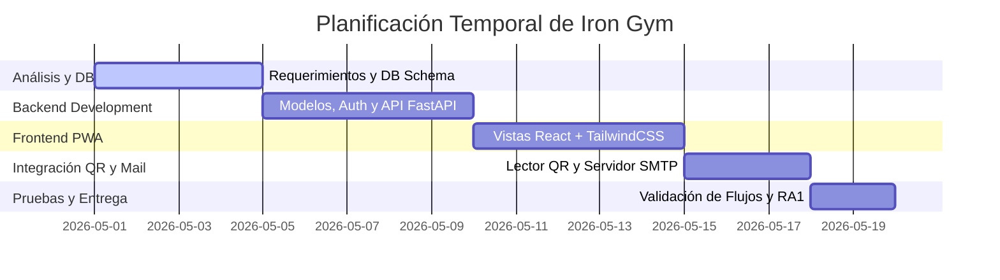

# Resultado de Aprendizaje 1 (RA1) - 1º DAW: Identificación de Necesidades del Sector Productivo

Este documento constituye la memoria técnica oficial del **Resultado de Aprendizaje 1 (RA1)** para el módulo de Proyecto de 1º de Desarrollo de Aplicaciones Web (DAW). Analiza el entorno sectorial, la justificación de negocio, el diseño organizativo, los requerimientos técnicos y las obligaciones legales asociadas al software **Iron Gym (Plataforma ERP y PWA de Gestión Integral de Centros Deportivos)**.

---

## 🏢 a) Clasificación de Empresas del Sector
El sector del bienestar físico, fitness y salud deportiva en España se ha transformado notablemente mediante la digitalización. Clasificamos las empresas según su tipología organizativa y de servicio:

### 1. Según su Estructura Organizativa y Alcance
*   **Gimnasios Independientes de Barrio (PYMEs)**: Centros pequeños de gestión unisede. Históricamente gestionados con plantillas físicas de papel o Excel, hoy demandan herramientas de digitalización asequibles.
*   **Cadenas de Gimnasios y Franquicias (Multi-sede)**: Redes a nivel nacional o regional (como Basic-Fit o Altafit) que requieren una gestión unificada y centralizada de sedes, aforo, empleados y cobros. **Iron Gym** se enfoca directamente en este modelo mediante su arquitectura de base de datos multi-inquilino (Multi-tenant) y multi-sede.
*   **Centros Especializados y Boxes de CrossFit (Boutique)**: Centros enfocados en el entrenamiento de alta intensidad, grupos reducidos y reservas de clases guiadas (spinning, pilates, yoga). Su modelo de negocio se basa en la limitación de aforos y el pago por uso o cuotas mensuales.

### 2. Según el Tipo de Servicio
*   **Servicio Completo y Libre Acceso**: Gimnasios tradicionales donde el socio acude libremente a usar las máquinas de cardio y fuerza. Requiere control de aforo y rutinas asignadas digitalmente.
*   **Servicios Dirigidos**: Clases con monitores que requieren gestión de reservas previas en la app móvil.
*   **Entrenamiento Personalizado y Salud**: Servicios de fisioterapia, nutrición y preparación física con seguimiento de medidas y progreso.

---

## 📐 b) Caracterización de una Empresa Tipo y Estructura Organizativa
Para la implantación del ecosistema **Iron Gym**, caracterizamos un centro deportivo tipo organizado jerárquicamente en departamentos:

### Funciones por Departamento y Relación con Iron Gym
*   **Dirección General (CEO/Franquiciado)**: Define los precios de los planes, analiza el volumen de negocio y el crecimiento de socios por sede. Utiliza la sección de analíticas y reportes de facturación del panel de administración general.
*   **Departamento de Recepción / Recepcionistas**: Primer punto de contacto con el cliente. Son los encargados de dar de alta nuevos socios, verificar el estado de los pagos y supervisar el acceso de usuarios escaneando su código QR interactivo de asistencia.
*   **Cuerpo Técnico / Entrenadores y Monitores**: Gestionan las actividades deportivas de la sala:
    *   *Monitores*: Crean y programan clases dirigidas (Spinning, Yoga, Pilates), limitando el aforo de reservas.
    *   *Entrenadores*: Elaboran rutinas de entrenamiento personalizadas para los clientes y realizan el seguimiento del progreso físico del socio (introduciendo peso, porcentaje de grasa y masa muscular).
*   **Departamento de Administración y Finanzas**: Controla el ciclo de ingresos. Utilizan el módulo de facturación para verificar los pagos completados, gestionar membresías activas o vencidas y registrar transacciones bancarias.
*   **Clientes (Usuarios Finales)**: Acceden a la Progressive Web App (PWA) de Iron Gym en sus móviles para reservar clases dirigidas, registrar sus marcas en el entrenamiento, subir su foto de perfil, ver su historial de progreso físico y presentar el código QR personal de acceso en el torno.

---

## 🎯 c) Necesidades más Demandadas a las Empresas del Sector
Para mantener su rentabilidad y competitividad, las empresas del sector fitness demandan soluciones que aborden las siguientes necesidades críticas:

| Necesidad Detectada | Solución Aportada por Iron Gym |
| :--- | :--- |
| **Control de Aforo y Accesos Automatizado** | Módulo de Asistencia QR escaneable desde la cámara del terminal en recepción que comprueba en tiempo real si el cliente dispone de membresía activa. |
| **Reserva Eficiente de Clases** | Calendario de reserva de clases grupales interactivo que evita la sobresaturación y respeta el límite máximo de alumnos. |
| **Fidelización y Seguimiento de Socios** | Visualización interactiva de rutinas de entrenamiento asignadas e histórico de progreso antropométrico mediante gráficas. |
| **Envío Automatizado de Notificaciones** | Integración de servidor SMTP para notificaciones de facturas emitidas, reservas confirmadas y avisos de renovación. |
| **Accesibilidad Multi-dispositivo** | Formato PWA (Progressive Web App) instalable en el smartphone del socio para uso ágil en la sala de pesas. |

---

## 📈 d) Oportunidades de Negocio Previsibles en el Sector
1.  **Gimnasios Inteligentes y Automatizados (Smart Gyms)**: Integración de la plataforma de accesos QR con puertas electromecánicas y tornos de sala para operar instalaciones desatendidas o en horarios ampliados (24 horas).
2.  **Modelo SaaS (Software as a Service) para Franquicias**: Proporcionar una infraestructura común donde el creador de la franquicia puede auditar todas las franquicias asociadas (aislamiento de datos multi-tenant y estadísticas agregadas).
3.  **Monetización de Rutinas y Clases Híbridas**: Ofrecer contenidos de entrenamiento online que el socio pueda consultar desde casa, ampliando los ingresos del centro más allá de la asistencia física.

---

## 💻 e) Tipo de Proyecto Requerido
Se requiere un **Sistema de Software Integral Multiplataforma (ERP + PWA)**, estructurado con una arquitectura desacoplada y modular para garantizar alto rendimiento y flexibilidad:

La separación física del Frontend (React + TailwindCSS compilado en Vite) y del Backend (FastAPI con conexión ORM) permite que la aplicación móvil de los clientes funcione de manera sumamente rápida, mientras que el servidor web ejecuta las validaciones y los envíos de correo en segundo plano.

---

## 🛠 f) Características Específicas del Proyecto y Requerimientos

### Requerimientos Funcionales (RF)
*   **RF1: Sistema de Seguridad y Perfiles**: Identificación de usuarios mediante email y contraseña cifrada con `bcrypt`. Roles de acceso definidos: Admin, Recepcionista, Entrenador y Cliente.
*   **RF2: Gestión de Sedes y Planes**: Administración multi-sede y catálogo de planes de suscripción mensual/anual de la cadena de gimnasios.
*   **RF3: Control de Accesos por QR**: Generación dinámica de códigos de acceso QR para los clientes. Lector QR por cámara web incorporado en la vista del recepcionista para registrar ingresos y salidas.
*   **RF4: Módulo de Reservas de Clases**: Programación de clases con día, hora, monitor y cupo de aforo. Los clientes pueden reservar o cancelar desde su portal.
*   **RF5: Planificador de Rutinas**: Los entrenadores diseñan rutinas asociando ejercicios, series, repeticiones y observaciones.
*   **RF6: Seguimiento del Progreso Físico**: Módulo antropométrico donde se registran variables como peso, grasa, músculo e hidratación, visualizadas en gráficas temporales.
*   **RF7: Notificaciones por Email (SMTP)**: Envío automático de confirmaciones, facturas de pago en formato legible y recordatorios de caducidad.
*   **RF8: Auditoría de Acciones**: Registro histórico de movimientos de caja, reservas anuladas y accesos de los empleados.

### Requerimientos No Funcionales (RNF)
*   **RNF1: PWA Instalable**: Soporte para manifest web y Service Worker (`sw.js`) que permite la instalación en dispositivos Android/iOS e icono de acceso directo en pantalla de inicio.
*   **RNF2: Rendimiento de la Base de Datos**: Uso de índices en claves foráneas y consultas eficientes mediante SQLAlchemy.
*   **RNF3: Interfaz Adaptable y Premium**: Estilado con TailwindCSS, variables CSS para soporte de Modo Oscuro, tipografía corporativa y diseño adaptado a pantallas táctiles.

---

## ⚖️ g) Obligaciones Fiscales, Laborales y de Prevención de Riesgos

### 1. Obligaciones Fiscales (España)
*   **Impuesto sobre el Valor Añadido (IVA)**: Aplicación del tipo impositivo del 21% general para los servicios deportivos e instalaciones de fitness en España. Los informes de cobros emitidos por la aplicación recopilan y desglosan esta información para la liquidación del Modelo 303 trimestral.
*   **Impuesto sobre Sociedades (IS)**: Liquidación anual sobre los beneficios obtenidos por el centro deportivo.
*   **Pasarela de Pagos**: Cumplimiento del estándar PCI-DSS para el almacenamiento seguro y la transmisión cifrada de datos de tarjetas de crédito si se asocia el cobro recurrente en línea.

### 2. Obligaciones Laborales y RGPD
*   **Convenio Colectivo de Instalaciones Deportivas**: Regula las categorías y salarios del personal contratado (entrenadores, recepcionistas, personal de limpieza).
*   **Tratamiento de Datos de Carácter Especial (Salud)**: Según el artículo 9 del Reglamento General de Protección de Datos (RGPD), los datos sobre medidas corporativas, peso, grasa física e historial de lesiones son clasificados como **datos médicos de categoría especial**. 
    *   *Medidas aplicadas*: Cifrado de bases de datos, acceso exclusivo de entrenadores a las fichas físicas de sus alumnos y obligación de firma del consentimiento explícito por parte del cliente al registrar su ficha de progreso.

### 3. Prevención de Riesgos Laborales (PRL)
Aplicación de la Ley 31/1995 de Prevención de Riesgos Laborales en el entorno deportivo:
*   **Riesgos para Trabajadores**: Lesiones musculoesqueléticas por demostración incorrecta de ejercicios a clientes (monitores), fatiga por ruido (clases colectivas de spinning con música alta), y riesgos ergonómicos en la recepción.
*   **Riesgos para Clientes (Seguridad de Instalaciones)**: Plan de evacuación en caso de emergencia, señalización de salidas de emergencia, instalación de desfibriladores (gimnasios cardioprotegidos) y revisiones de seguridad en el equipamiento de fuerza y poleas.

---

## 🎁 h) Posibles Ayudas o Subvenciones para Incorporación de Nuevas Tecnologías
*   **Línea Kit Digital (Fondos Europeos NextGenerationEU)**: Orientada a la digitalización del centro deportivo. Cubre la adquisición de la PWA de clientes y panel de gestión en la categoría de "Gestión de procesos" y "Gestión de clientes" hasta un total de 6.000 € para microempresas y PYMEs.
*   **Subvenciones Autonómicas al Fomento de la Práctica Deportiva**: Ayudas directas a la modernización tecnológica y adecuación de centros de entrenamiento físico, financiando parte del hardware de recepción (lector de accesos QR, tablets para entrenadores).
*   **Programas de Transición Ecológica y Eficiencia Energética**: Ayudas destinadas a instalar sensores de control de aforo e iluminación eficiente (como los que se pueden gestionar mediante el análisis de horas pico que proporciona el histórico de asistencia QR de Iron Gym).

---

## 📝 i) Guion de Trabajo Seguido para la Elaboración del Proyecto
La planificación temporal y metodológica seguida para el desarrollo del ecosistema Iron Gym se estructura de la siguiente manera:

### Detalle de Tareas del Guion
1.  **Fase 1: Análisis y Definición del Modelo**: Modelado de bases de datos relacionales en MySQL, definiendo las relaciones entre usuarios, clases, reservas, rutinas, progresos y auditorías (usando claves foráneas indexadas y borrado lógico).
2.  **Fase 2: Backend robusto (FastAPI)**:
    *   Implementación de modelos SQLAlchemy.
    *   Diseño de autenticación JWT y encriptación hash bcrypt.
    *   Configuración del servicio SMTP para envío de notificaciones por email.
    *   Estructura multi-tenant para permitir el aislamiento de datos por sede.
3.  **Fase 3: Frontend PWA e Interfaz de Clientes (React)**:
    *   Implementación de layouts de dashboards diferenciados por rol (Admin, Monitor, Cliente, Recepcionista).
    *   Diseño responsivo móvil optimizado y registro del Service Worker (`sw.js`) para habilitar capacidades PWA.
4.  **Fase 4: Integración del Hardware Virtual (QR y Cámara)**:
    *   Integración del lector QR en JS usando la cámara en la recepción.
    *   Pruebas de aforo dinámico y restricciones de membresía activa.
5.  **Fase 5: Verificación final**:
    *   Carga de datos simulada y pruebas funcionales mediante subagentes del navegador.
    *   Elaboración de informes de cumplimiento y memorias técnicas académicas (RA1).
