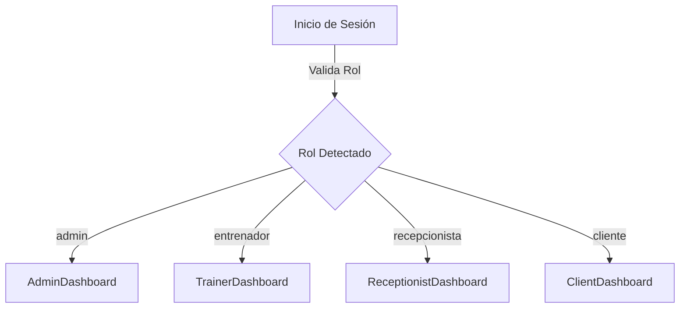

# Análisis de Importancia: Rol de Recepcionista en Iron Gym

El rol de **recepcionista** (`recepcionista`) está definido en la base de datos a nivel de enumerado (`RolUsuario` en backend), pero carece de representación funcional (rutas, redirecciones y dashboards dedicados) en la interfaz de React. 

Este análisis evalúa su importancia y el impacto de su ausencia de cara a un proyecto final de **1º DAW**.

---

## 🎯 1. Importancia del Rol en la Operativa Real

En la gestión diaria de un gimnasio físico, la división de responsabilidades es clave. El recepcionista es el operador principal del software en la entrada del local:

1.  **Control de Accesos (QR)**: Es quien supervisa la pantalla de accesos en tiempo real cuando un socio escanea su código QR.
2.  **Registro Rápido de Socios (Alta)**: Da de alta a clientes nuevos presenciales e introduce sus contraseñas iniciales.
3.  **Captura de Fotografías**: Utiliza la webcam para tomar la fotografía identificativa del socio.
4.  **Gestión de Membresías**: Cambia el estado de los pagos y activa las tarjetas al recibir los pagos en efectivo o tarjeta física.

---

## 🛡️ 2. Importancia Académica y de Seguridad (DAW)

De cara a la evaluación del proyecto de DAW por un tribunal, la implementación de este rol aporta tres factores esenciales:

*   **Principio de Menor Privilegio (Least Privilege)**: Actualmente, para realizar tareas rutinarias como capturar una foto o abrir el lector QR, el personal de recepción debe iniciar sesión como **Administrador**. Esto expone información financiera sensible (gráfica de ingresos mensuales, analíticas de facturación) y funciones críticas (eliminar entrenadores, dar de baja clases dirigidas) a empleados que no deberían gestionarlas.
*   **Diseño de Seguridad y RBAC (Role-Based Access Control)**: Contar con una jerarquía de acceso completa (Cliente -> Entrenador -> Recepcionista -> Administrador) demuestra un dominio profesional de la seguridad en el desarrollo web.
*   **Eliminación de Rutas Huérfanas**: Dejar un rol definido en la base de datos que se comporta de forma errática en el frontend (redirigiendo a la vista de cliente al iniciar sesión) se considera un error de diseño de interfaz (UI/UX).

---

## 🛠️ 3. Propuesta Técnica de Implementación

Para subsanar esta carencia y elevar la calidad del proyecto a un nivel de excelencia, se puede estructurar el sistema de la siguiente forma:



### Cambios a realizar en el Código:

1.  **Frontend - Nueva Página**: Crear `src/pages/ReceptionistDashboard.jsx` extrayendo las funciones de recepción de `AdminDashboard.jsx`:
    *   Lector QR en vivo (`Html5QrcodeScanner`).
    *   Buscador y tabla de clientes (con activación/bloqueo de membresía y captura de fotografía por webcam).
    *   Módulo de "Alta Rápida" de clientes.
2.  **Frontend - Enrutamiento**:
    *   En `src/App.jsx`, añadir la ruta `/recepcionista` protegida para esta vista.
    *   En `src/components/LoginModal.jsx`, actualizar la redirección inteligente:
        ```javascript
        if (data.usuario.rol === 'admin') {
          navigate('/admin')
        } else if (data.usuario.rol === 'recepcionista') {
          navigate('/recepcionista')
        } else if (data.usuario.rol === 'entrenador') {
          navigate('/entrenador')
        } else {
          navigate('/cliente')
        }
        ```
3.  **Frontend - Limpieza**: Retirar de `AdminDashboard.jsx` los elementos operativos diarios que ahora pertenecen al recepcionista, dejando al administrador las tareas de supervisión macro (ingresos, programación de clases dirigidas y gestión del personal técnico).
